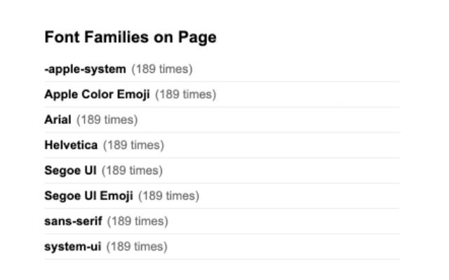
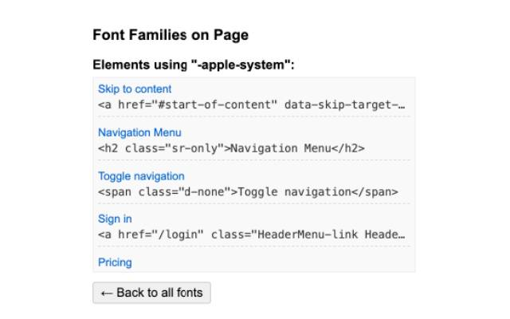

# Font Family Detector

A lightweight Chrome extension that detects and lists all font families used on the current page, along with their usage counts. With a single click, you can explore which elements on the page are using a specific font family.




## 🚀 Features

- Lists all font families used on the page.
- Shows how many times each font family is used.
- Click on a font family to highlight all elements that use it.
- Clean and minimal UI.
- Useful for designers, developers, and typographic enthusiasts.

## 🧠 How It Works

When you activate the extension on a page, it scans all visible elements in the DOM and collects their computed `font-family` values. It then displays:

- A deduplicated list of fonts.
- The number of occurrences for each font.
- A clickable interface to view matched elements.

## 👉 Available on Chrome Web Store

[🔗 Install Font Family Detector from Chrome Web Store](https://chromewebstore.google.com/detail/aghflnmekhbmomiopkifkkjnfmmhfdbg?utm_source=item-share-cb)

## 🖱️ Usage

1. Visit any website.
2. Click the **Font Family Detector** icon in the Chrome toolbar.
3. The popup will display all detected font families and how many times they’re used.
4. Click on a font family name to see which elements are using it (they will be highlighted on the page).

## 🛠️ Development / Contributing

### 📦 Installation

If you'd like to contribute or modify the extension:

1. Clone the repository:
   ```bash
   git clone https://github.com/yigitardaunsal/font-family-detector.git
   ```
2. Open Chrome and go to `chrome://extensions/`.
3. Enable "Developer mode" (top-right).
4. Click "Load unpacked" and select the cloned project folder.

Feel free to submit issues or pull requests on [GitHub](https://github.com/yigitardaunsal/font-family-detector).

### 📁 Project Structure

```
font-family-detector/
├── popup.html           # Extension popup UI
├── popup.js             # Logic to render font data
├── manifest.json        # Chrome extension manifest
└── ...
```

### 🧪 TODO / Improvements

- Add support for filtering by tag name or class.
- Show actual font preview next to names.
- Export report as JSON or CSV.
- Add dark mode support for popup.

## 🙌 Acknowledgements

Made with ❤️ by [Yiğit Arda Ünsal](https://github.com/yigitardaunsal)

Special thanks to [Nurgül Yiğit](https://github.com/nurguloner) for helping test and improve the extension.

## 📄 License

MIT License
